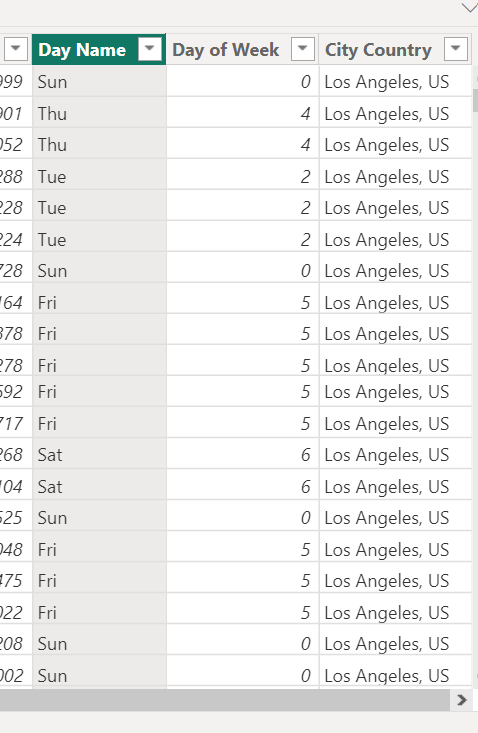
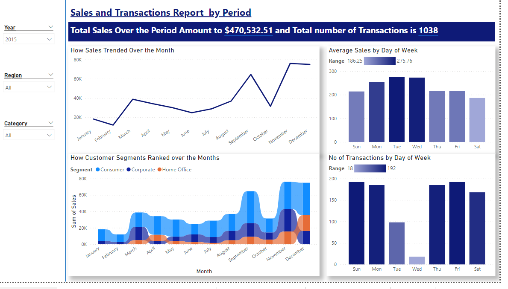
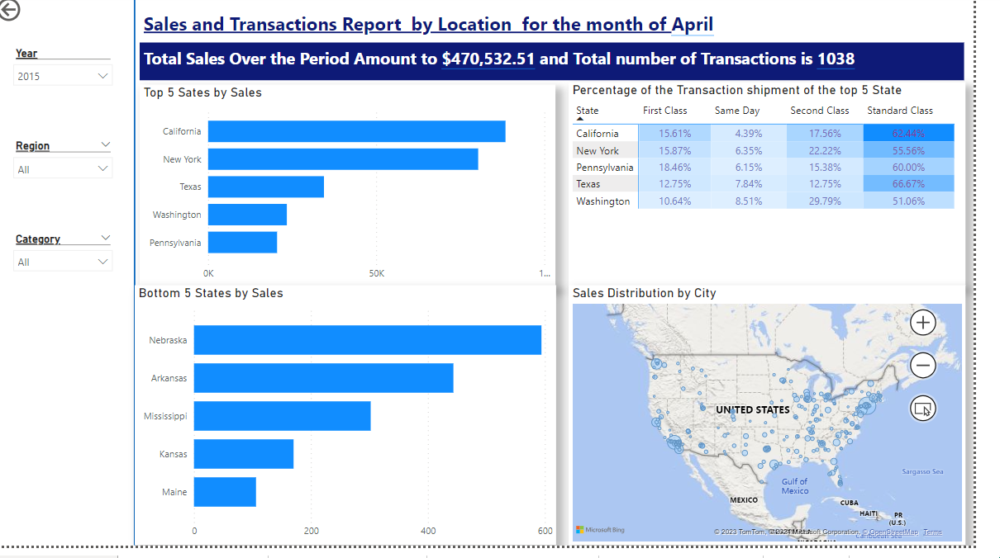
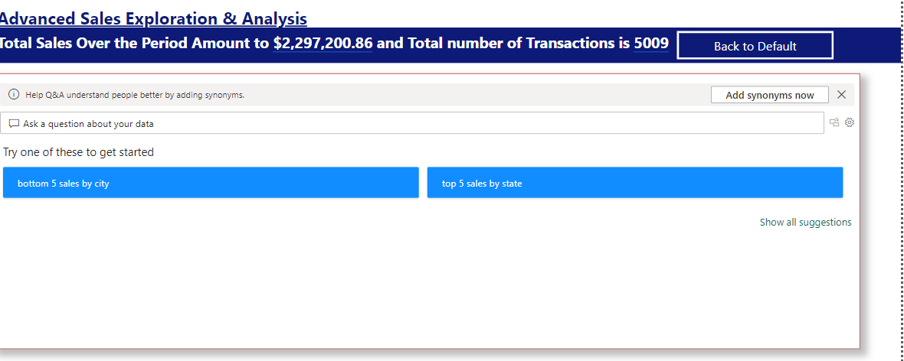

# US Superstore Data Analysis

## Introduction
This is a power bi project on sales analysis of an imaginary store called  **US superstore data**.
The project is to analyze and derive insights to answer crucial questions and help the store make data driven decisions.

**_DISCLAIMERS_**: _All datasets and reports do not represent any company, institutions or countries, but just a dummy dataset to demonstrate capabilities of Power BI._

## Problem Statement
1.	How sales trended over the month.
2.	Top and Bottom 5 states by sales.
3.	No of transactions by day of week.
4.	Average sales by day of week.
5.	How customer segments ranked over the months.
6.	Sales distributions by city.
7.	Percentage of the transaction shipment of the top 5 state.

## Data Sourcing
Not until I came up with the above mentioned questions did I went ahead to get the data. I then downloaded the csv file, and extracted it into Power BI for cleaning, analysis and visualization.
### It contains 1 sheet:
ORDERS with 9995 rows and 22 columns.

## Skills/ Concepts demonstrated

- DAX.
- Calculated column. 
- Duplicate data.
- Filters.
- IF().
- Page navigation.
- Quick Measures.
- Tooltip.
- Bookmark.
- Selection.
- Button.
- Q&A setup.
- Slicers.
- Drill-Through.

## Applied Steps/Columns: 

- Day Name: the column was used to derive the days of the week from the order date column.
- Day of week: it was used to count the number the days appeared.
- City Country: was used to focus on the dataset and not divert from the US region.

## Visualization:

The report comprises 3 pages:
1.	Periodic Report.
2.	Location Report.
3.	Advanced Analysis.

## Periodic Report

Feature:
- Slicer provides easy access to frequently used filters.

## Location Report

Features:
- Slicer provides easy access to frequently used filters.
- Drill_through create a destination target page in your report that focuses on a specific entity.
- Map.

## Advanced Analysis

Features:
- Bookmark captures the state of a report page.
- Selection provides a list of all the objects on the current page and can be used to hide/unhide those objects.
- Q & A setup is used to explore your data using natural language capabilities and receive answers in the form of charts and graphs.

## Conclusion and Recommendation:
- The standard class is the most used mode for shipment in all years.😋
- The average sales of phones is 371.2. This is 141.4 units higher than the overall average of sales which is 229.9.🥰

## Recommendation:
For a deep dive into the analytics, the dataset of other stores will be required for comparison and data driven decision making.

